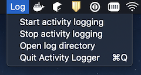
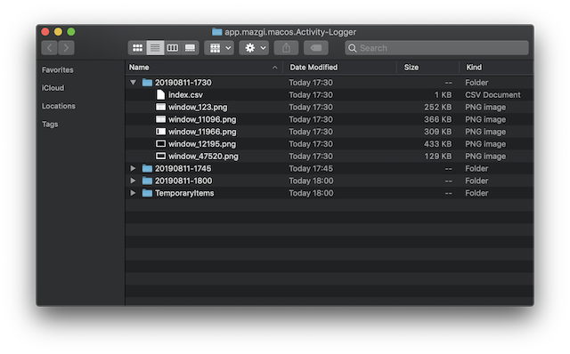

# Activity Logger

Logging your activity on macOS.

## Requirements

- **macOS** 10.13+

## Basic features

This app collects your activity on macOS every 15 minutes.  
That include all displays and all workspaces.

You can get your activity logs as bellow formats.

- Window list as CSV format
- Each window capture as a PNG image

This app CANNOT collect any activity from other hosts.  
And this app CANNOT send your activities any other host or any place.  
But we planning the feature that stores activity logs to Object Storages like S3 or GCS.

## How to Use

1. Launch this app.
2. Select `Start activity logging` item on the `Log` menu bar item.

3. You can show your activity logs for select `Open log directory` item.

## License

Activity Logger is released under the MIT license. See [LICENSE](https://github.com/mazgi/activity-logger/blob/master/LICENSE) for more information.
